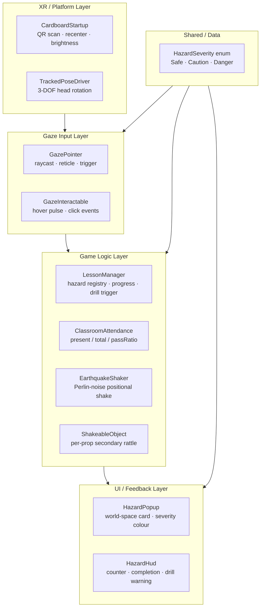
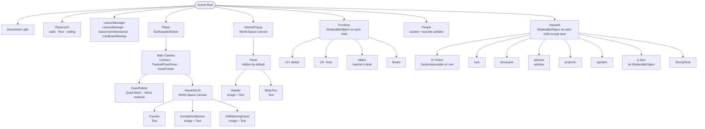
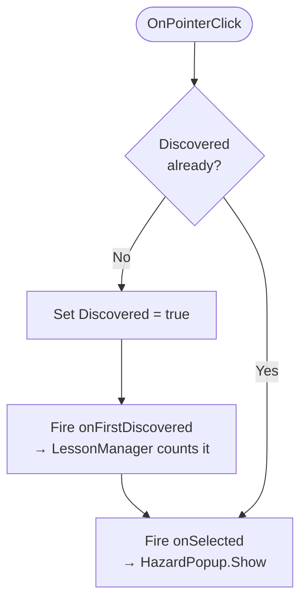
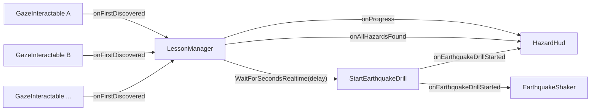
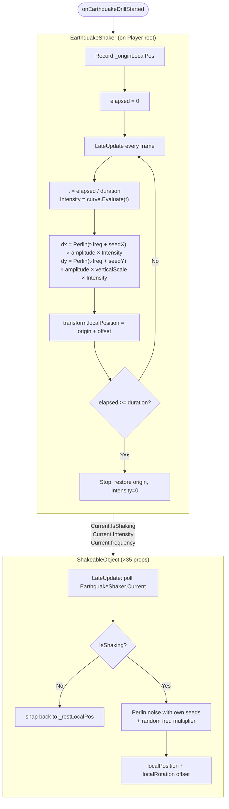
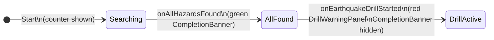
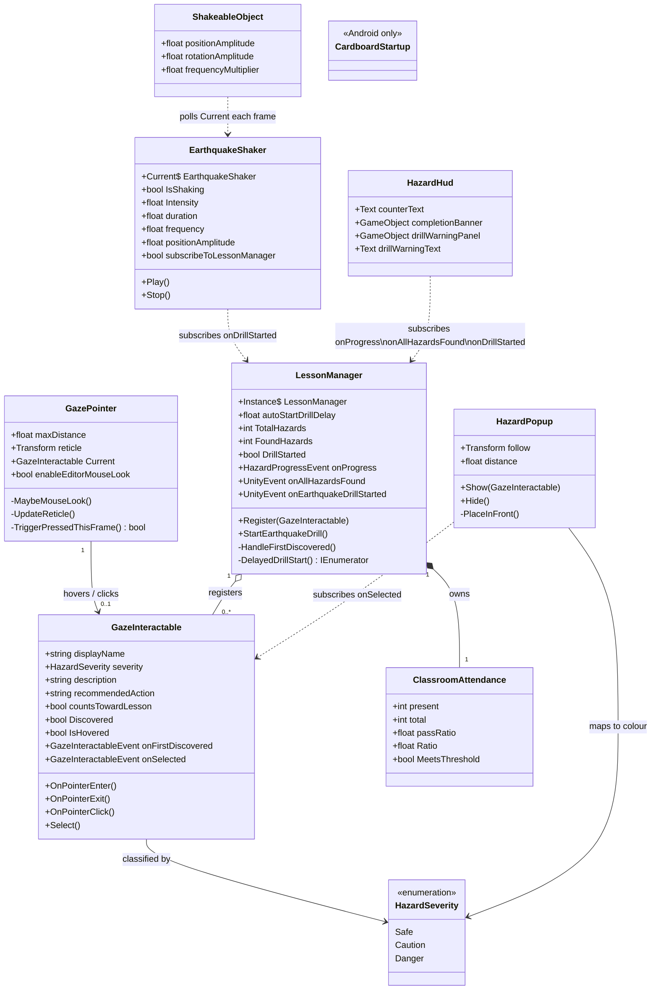
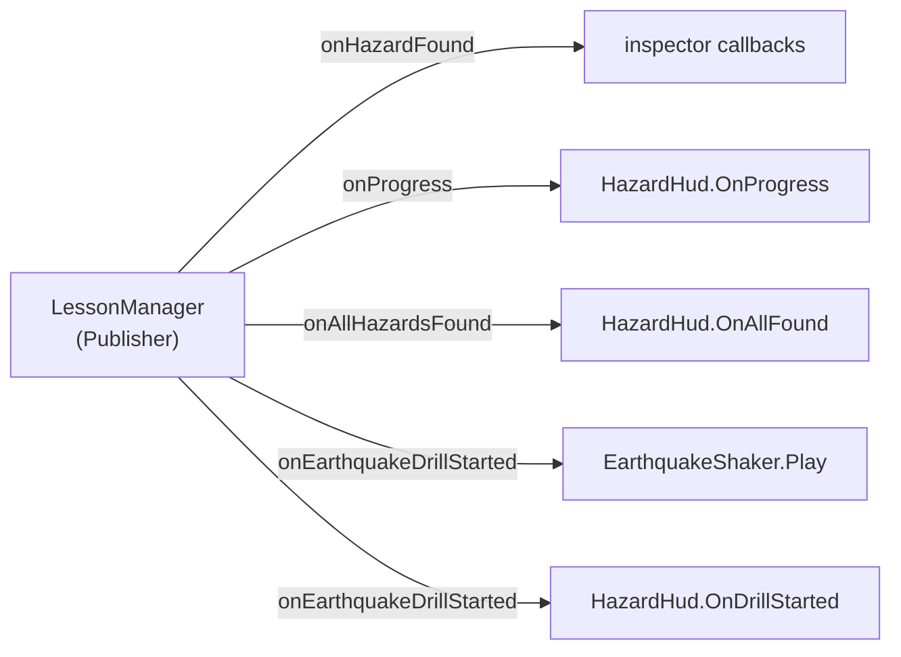
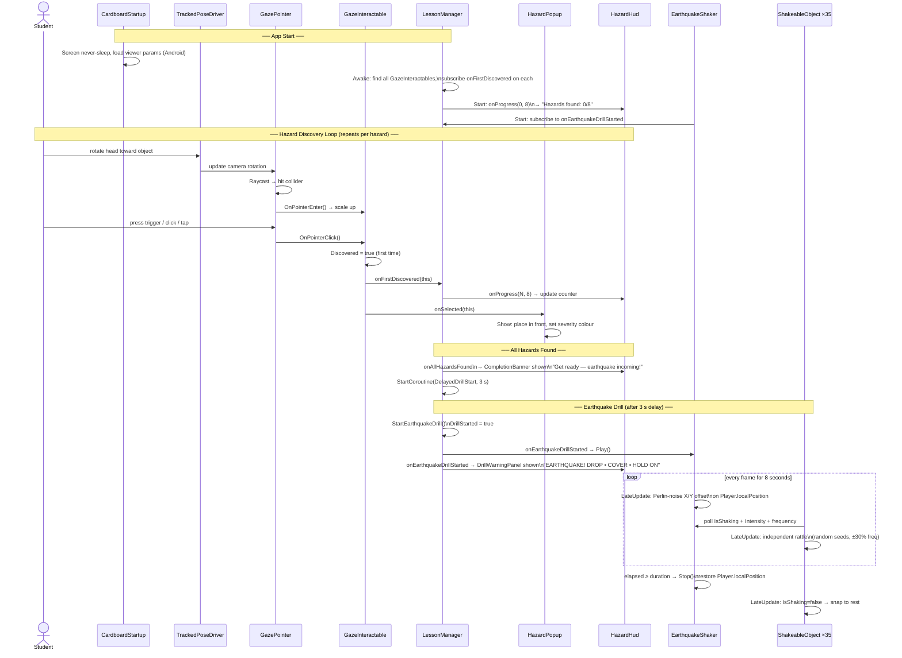
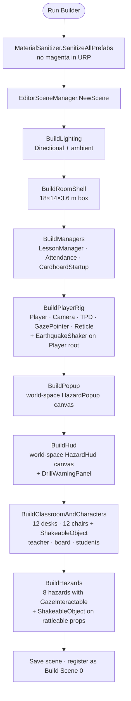

# GazeBasedVR — Architecture & Design Documentation

A Unity 6 VR application for earthquake-safety education in a school classroom.
Students use **gaze** to identify hazards, then experience a procedural earthquake drill.

---

## Table of Contents

1. [Tech Stack](#1-tech-stack)
2. [High-Level Architecture](#2-high-level-architecture)
3. [Scene Hierarchy](#3-scene-hierarchy)
4. [Runtime Systems](#4-runtime-systems)
   - 4.1 [Gaze Input System](#41-gaze-input-system)
   - 4.2 [Lesson & Progression System](#42-lesson--progression-system)
   - 4.3 [Earthquake Simulation System](#43-earthquake-simulation-system)
   - 4.4 [UI System](#44-ui-system)
   - 4.5 [XR / Cardboard Layer](#45-xr--cardboard-layer)
5. [Class Relationships](#5-class-relationships)
6. [Design Patterns](#6-design-patterns)
7. [End-to-End Program Flow](#7-end-to-end-program-flow)
8. [Event Architecture](#8-event-architecture)
9. [Editor Tooling](#9-editor-tooling)
10. [Platform & Build Configuration](#10-platform--build-configuration)

---

## 1. Tech Stack

| Layer | Technology | Version |
|---|---|---|
| Engine | Unity 6 | 6000.x |
| Render Pipeline | Universal Render Pipeline (URP) | 17.4.0 |
| XR SDK | Google Cardboard XR Plugin | via Package Manager |
| Input | Unity Input System | 1.19.0 |
| Head Tracking | `TrackedPoseDriver` (XR Core Utils) | built-in |
| Navigation (future) | Unity AI Navigation / NavMesh | 2.0.11 |
| Scripting | C# (.NET Standard 2.1) | — |
| Testing | Unity Test Framework (NUnit) | 1.6.0 |
| Color Space | Linear | — |
| Target Platform | Android (Cardboard) + Editor (desktop) | — |

---

## 2. High-Level Architecture

The application is divided into five horizontal layers. Each layer depends only on the ones below it.



---

## 3. Scene Hierarchy



---

## 4. Runtime Systems

### 4.1 Gaze Input System

**Scripts:** `GazePointer`, `GazeInteractable`

`GazePointer` fires a `Physics.Raycast` from the camera's forward vector every frame — this *is* the gaze on a 3-DOF Cardboard headset. It drives hover transitions and dispatches the trigger-press to the currently-hovered `GazeInteractable`.

`GazeInteractable` is a data + behaviour component placed on any collidable prop. It owns the hover-pulse scale animation and the Discovered flag. It deliberately uses Unity `SendMessage`-compatible method names (`OnPointerEnter`, `OnPointerExit`, `OnPointerClick`) so it works with both `GazePointer` and Google's legacy `CardboardReticlePointer` without a code change.

**Click logic:**



**Editor / desktop fallback:** When no XR device is active, `GazePointer` enables right-mouse-drag mouse-look so the entire mechanic is testable in the Unity Editor without a headset.

---

### 4.2 Lesson & Progression System

**Scripts:** `LessonManager`, `ClassroomAttendance`

`LessonManager` is the central coordinator. On `Awake` it auto-discovers every `GazeInteractable` with `countsTowardLesson = true` and subscribes to each one's `onFirstDiscovered` event. It maintains an internal `HashSet` of found hazards so duplicate selections are idempotent.



`ClassroomAttendance` is a simple data container (present / total / passRatio). It exists as a separate component to keep headcount concerns outside of `LessonManager` and to allow independent testing.

**Automatic drill trigger:** When the last hazard is found, `LessonManager` starts a `WaitForSecondsRealtime` coroutine. After `autoStartDrillDelay` seconds (default 3 s), `StartEarthquakeDrill()` is called. Using `WaitForSecondsRealtime` means the delay is immune to `Time.timeScale` changes.

---

### 4.3 Earthquake Simulation System

**Scripts:** `EarthquakeShaker`, `ShakeableObject`

Two cooperating components produce layered shake: one for the player's view, one for the environment.



**Key design decision — polling vs. events for `ShakeableObject`:** With 35+ shakeable objects in the scene, subscribing each one to `onEarthquakeDrillStarted` would require 35 subscribe/unsubscribe calls and would leave dangling listeners if an object is destroyed mid-shake. Polling `EarthquakeShaker.Current` each `LateUpdate` is zero-allocation and self-cleaning — if `Current` is null or `IsShaking` is false the object simply snaps back, with no cleanup required.

**VR comfort:** `EarthquakeShaker` only displaces the Player's `localPosition` (lateral X + subtle vertical Y). Rotation is disabled by default (`rotationAmplitude = 0`). This prevents fighting with the `TrackedPoseDriver` rotation on the camera, which would cause disorienting conflicts in a 3-DOF Cardboard headset.

**Per-object randomisation:** Each `ShakeableObject` seeds its six Perlin-noise axes with `Random.Range(0, 512)` in `Awake` and multiplies `EarthquakeShaker.frequency` by a random ±30 % factor. This ensures a room full of identical desks still rattles organically.

---

### 4.4 UI System

**Scripts:** `HazardPopup`, `HazardHud`

Both canvases use **World Space** render mode — required for correct stereo rendering in Cardboard VR. Screen-space overlays only render to one eye.

| Canvas | Parent | Purpose |
|---|---|---|
| `HazardHUD` | Main Camera | Locked to the player's view; always visible |
| `HazardPopup` | Scene root | Floats in world space; faces the player via `LookRotation` |

**HazardPopup** subscribes to every `GazeInteractable.onSelected` in `Start`. When shown, it places itself `distance` metres in front of the player's horizontal gaze direction (Y clamped to avoid extreme up/down placement), then uses `LateUpdate` to keep facing the player as they move.

**HazardHud** drives three mutually exclusive panels based on lesson state:



`HazardSeverity` drives the popup's header colour without any conditional logic in `HazardPopup` itself — the enum value is mapped to a colour via a C# `switch` expression, keeping all colour decisions in one place.

---

### 4.5 XR / Cardboard Layer

**Script:** `CardboardStartup`

`CardboardStartup` handles all Google Cardboard API calls. Every Cardboard API call is wrapped in `#if UNITY_ANDROID && !UNITY_EDITOR`, making this component a no-op in the Editor and on non-Android targets. This means the rest of the codebase is completely platform-agnostic.

| Responsibility | How |
|---|---|
| Keep screen awake | `Screen.sleepTimeout = SleepTimeout.NeverSleep` |
| Load viewer lens params | `Api.ScanDeviceParams()` on first run |
| Recenter HMD | `Api.Recenter()` on long trigger hold |
| Reload changed params | `Api.ReloadDeviceParams()` when `HasNewDeviceParams()` |
| Quit | `Application.Quit()` on close button |

Head rotation is provided by the `TrackedPoseDriver` component on the camera, set to `RotationOnly` tracking. This preserves the manually set eye height (`y = 1.6 m`) rather than snapping to the HMD origin.

---

## 5. Class Relationships



---

## 6. Design Patterns

### Singleton (Convenience Singleton)

`LessonManager.Instance` and `EarthquakeShaker.Current` expose a global access point without relying on `FindObjectOfType` (which is slow). Both self-null on `OnDestroy` so they are scene-scoped and safe across scene reloads.

```
// Any script can do this without a serialized reference:
LessonManager.Instance?.StartEarthquakeDrill();
EarthquakeShaker.Current?.IsShaking
```

### Observer (UnityEvent / Publish–Subscribe)

`LessonManager` fires four typed events. Listeners subscribe in their own `Start` and unsubscribe in `OnDestroy`, keeping coupling unidirectional — the game logic layer has no knowledge of the UI layer.



`GazeInteractable` also uses this pattern, with `onFirstDiscovered` and `onSelected` events that the popup and lesson manager subscribe to independently.

### Polling (Pull model for secondary shakers)

`ShakeableObject` **polls** `EarthquakeShaker.Current` instead of subscribing to `onEarthquakeDrillStarted`. Rationale: with 35+ instances, event subscription would require 35 Add/Remove listener calls and manual cleanup if an object is destroyed during a shake. Polling is zero-allocation and self-cleaning — no subscribe, no unsubscribe, no dangling reference risk.

### Entity–Component (Unity's model)

Behaviour is composed from small, single-purpose components rather than deep inheritance trees:

| Component | Single responsibility |
|---|---|
| `GazeInteractable` | Hover feedback + click event dispatch |
| `EarthquakeShaker` | Player-rig shake driven by intensity curve |
| `ShakeableObject` | Prop rattle, polling the shaker |
| `CardboardStartup` | Platform initialisation only |
| `ClassroomAttendance` | Headcount data only |

### Builder (Editor Tool)

`ClassroomBuilder` is a static editor-only builder that constructs the entire scene procedurally from configuration constants (`W`, `D`, `H`, prefab paths). This separates scene construction from runtime logic and allows the scene to be regenerated cleanly. The builder is intentionally unreachable at runtime (`Assets/Editor/` folder).

### Strategy (via Enum dispatch)

`HazardSeverity` acts as a strategy selector. Instead of subclassing `GazeInteractable` for each type of hazard, a single enum value drives header colour in `HazardPopup` and messaging tone. New severity levels can be added by extending the enum without touching class hierarchies.

### Façade

`LessonManager` exposes `TotalHazards`, `FoundHazards`, `DrillStarted`, and its four events as the only public surface. The internal `List<GazeInteractable>` (registry) and `HashSet<GazeInteractable>` (found set) are completely private.

### Graceful Degradation (Platform Abstraction)

`CardboardStartup` and `GazePointer` are designed so the full scene runs in the Unity Editor without any VR device:
- All `Google.XR.Cardboard.Api` calls compile away via `#if UNITY_ANDROID && !UNITY_EDITOR`
- `GazePointer.enableEditorMouseLook` provides right-mouse-drag look and left-click/Space for the trigger
- `TriggerPressedThisFrame()` checks Cardboard, Mouse, Keyboard, and Touchscreen in priority order

---

## 7. End-to-End Program Flow



---

## 8. Event Architecture

All cross-system communication uses Unity `UnityEvent` or the typed `GazeInteractableEvent` / `HazardProgressEvent` wrappers. No `GetComponent` calls happen at event-dispatch time — all listeners are registered once in `Start`.

```mermaid
flowchart TB
    subgraph EMITTERS["Event Emitters"]
        GI["GazeInteractable\nonFirstDiscovered\nonSelected"]
    end

    subgraph BROKER["Event Broker"]
        LM["LessonManager\nonHazardFound\nonProgress\nonAllHazardsFound\nonEarthquakeDrillStarted"]
    end

    subgraph LISTENERS["Listeners"]
        HP[HazardPopup]
        HH[HazardHud]
        ES[EarthquakeShaker]
        INS[Inspector callbacks\n(optional, inspector-wired)]
    end

    GI -- "onFirstDiscovered\n(registered in LM.Awake)" --> LM
    GI -- "onSelected\n(registered in HP.Start)" --> HP

    LM -- "onProgress" --> HH
    LM -- "onAllHazardsFound" --> HH
    LM -- "onEarthquakeDrillStarted" --> ES
    LM -- "onEarthquakeDrillStarted" --> HH
    LM -- "onHazardFound\nonAllHazardsFound\nonEarthquakeDrillStarted" --> INS
```

**Subscription lifecycle:**

| Component | Subscribes in | Unsubscribes in |
|---|---|---|
| `LessonManager` | `Awake` (to each `GazeInteractable`) | automatic (GazeInteractable destroyed = no-op) |
| `EarthquakeShaker` | `Start` | implicit (`LessonManager` destroyed = no-op) |
| `HazardPopup` | `Start` | — (popup outlives hazards) |
| `HazardHud` | `Start` | `OnDestroy` |

---

## 9. Editor Tooling

All editor scripts live under `Assets/Editor/` and are stripped from builds.

### ClassroomBuilder

**Menu:** `GazeVR ▸ Build Earthquake Classroom Scene`

Procedurally constructs the entire `EarthquakeClassroom.unity` scene from scratch:



### MaterialSanitizer

**Menu:** `GazeVR ▸ Fix Materials (No Magenta)`

Scans all prefabs under `Assets/Environments` and `Assets/Characters` and repairs materials that would render as magenta under URP:

- **Null slot** → replaced with a shared `URP_Fallback.mat`
- **Standalone `.mat` asset** → shader upgraded in-place to `Universal Render Pipeline/Lit` (colour and texture preserved)
- **Embedded FBX material** → a URP copy is generated in `Assets/_GazeVR/Materials/` (the original FBX is read-only)

### AndroidCardboardSetup

**Menu:** `GazeVR ▸ Configure Android + Cardboard Player Settings`

One-click player settings alignment for a Cardboard Google Play submission:

| Setting | Value | Reason |
|---|---|---|
| Color Space | Linear | Required by URP |
| Graphics API | OpenGLES3 | Cardboard minimum |
| Scripting Backend | IL2CPP | Google Play requirement |
| Architecture | ARM64 | Google Play 64-bit requirement |
| Min SDK | API 25 | Cardboard SDK minimum |
| Orientation | Landscape Left | Cardboard stereo split-screen |

---

## 10. Platform & Build Configuration

### Render Pipeline

Two URP pipeline assets exist for quality targeting:

| Asset | Target | Notes |
|---|---|---|
| `PC_RPAsset` + `PC_Renderer` | Desktop / Editor | Higher quality, shadow distance |
| `Mobile_RPAsset` + `Mobile_Renderer` | Android / Cardboard | Optimised for mobile GPU |

### Input System

The project uses the **new Input System** (`com.unity.inputsystem 1.19.0`) exclusively. The action asset `InputSystem_Actions.inputactions` defines two action maps:

- **Player**: Move, Look, Jump, Sprint, Interact (Hold), Attack, Previous, Next
- **UI**: Navigate, Submit, Cancel, Point, Click, ScrollWheel, TrackedDevicePosition / Orientation

Control schemes include `Keyboard&Mouse`, `Gamepad`, `Touch`, and **`XR`** (with `<XRController>` bindings). `GazePointer` reads directly from `Mouse.current` / `Keyboard.current` / `Touchscreen.current` rather than the action asset for simplicity, since gaze input has no rebinding requirement.

### Namespace

All runtime scripts live in the `GazeVR` namespace. Editor tools live in `GazeVR.EditorTools`. This prevents accidental name collisions with Unity built-ins and third-party packages.

### Code Folder Layout

```
Assets/
├── Editor/
│   ├── AndroidCardboardSetup.cs   ← build tooling
│   ├── ClassroomBuilder.cs        ← scene generator
│   └── MaterialSanitizer.cs       ← URP material fixer
├── Scripts/
│   ├── HazardSeverity.cs          ← shared enum
│   ├── Cardboard/
│   │   └── CardboardStartup.cs    ← XR platform init
│   ├── Game/
│   │   ├── ClassroomAttendance.cs ← headcount data
│   │   ├── EarthquakeShaker.cs    ← player-rig shake
│   │   ├── LessonManager.cs       ← lesson coordinator
│   │   └── ShakeableObject.cs     ← prop rattle
│   ├── Gaze/
│   │   ├── GazeInteractable.cs    ← selectable prop
│   │   └── GazePointer.cs         ← gaze raycast + reticle
│   └── UI/
│       ├── HazardHud.cs           ← camera-locked HUD
│       └── HazardPopup.cs         ← world-space info card
├── Scenes/
│   └── EarthquakeClassroom.unity
└── Settings/
    ├── PC_RPAsset.asset
    ├── Mobile_RPAsset.asset
    └── ...
```
