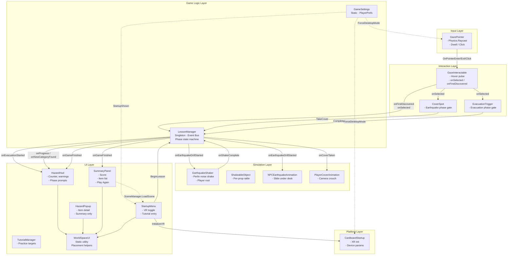
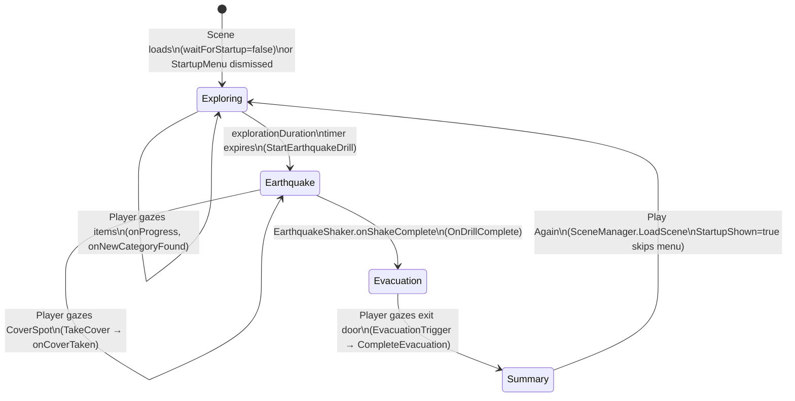
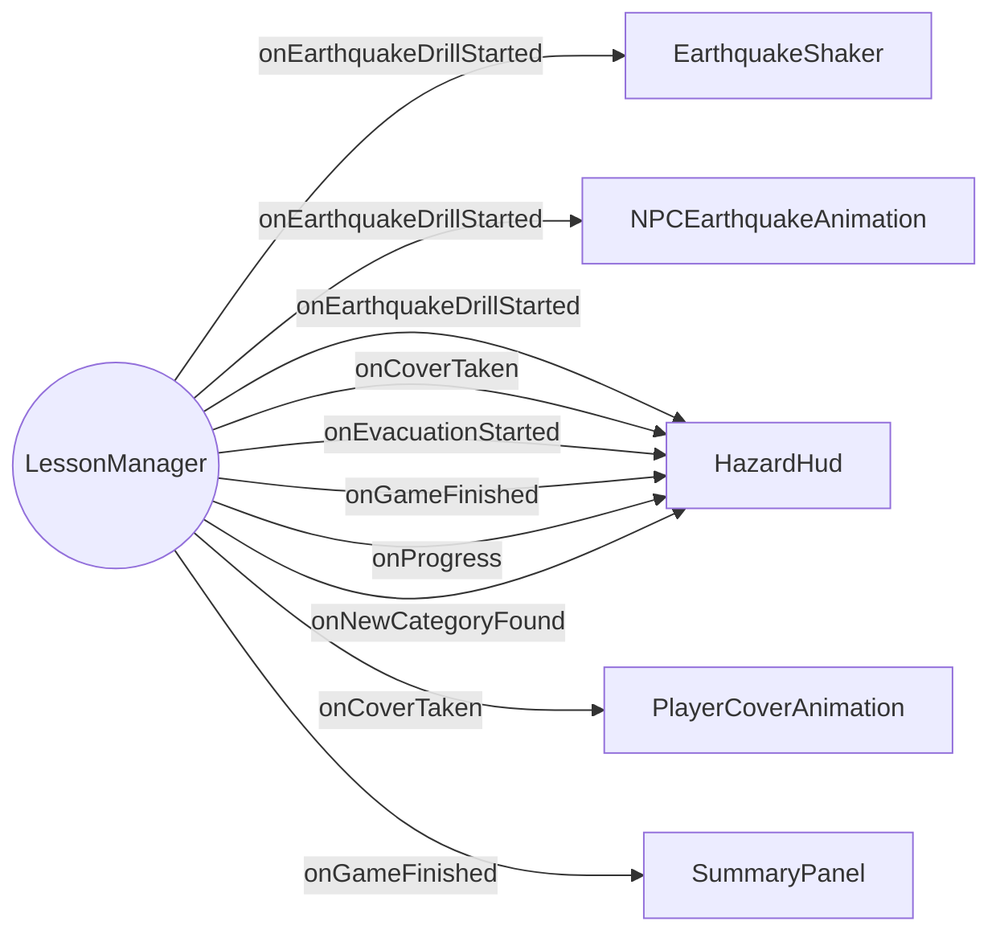
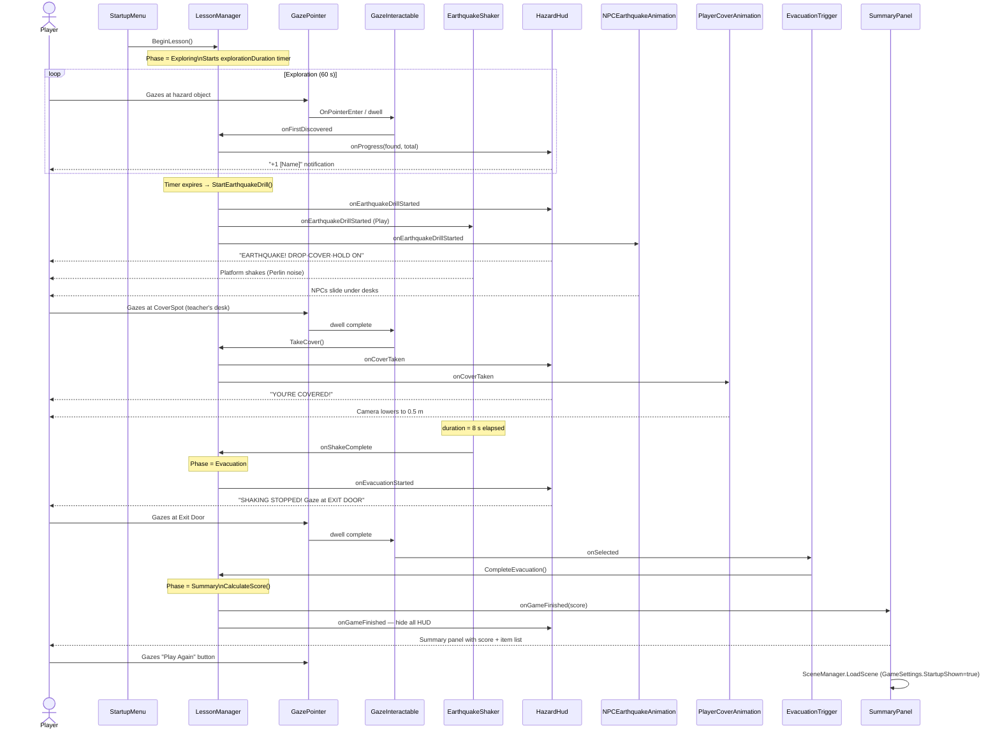
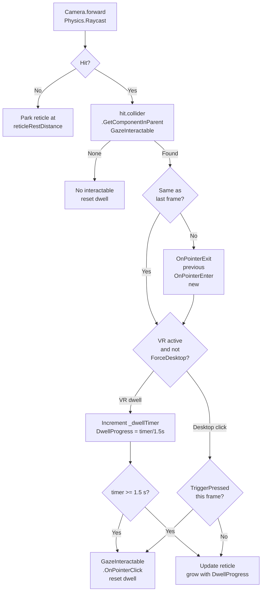

# GazeBasedVR — Architecture & Design Documentation

## Table of Contents
1. [Project Overview](#1-project-overview)
2. [System Architecture](#2-system-architecture)
3. [Layer Breakdown](#3-layer-breakdown)
4. [Game State Machine](#4-game-state-machine)
5. [Design Patterns](#5-design-patterns)
6. [Event Flow](#6-event-flow)
7. [Gaze Input Pipeline](#7-gaze-input-pipeline)
8. [VR / Desktop Dual-Mode](#8-vr--desktop-dual-mode)
9. [Cross-Scene Persistence](#9-cross-scene-persistence)
10. [Key Architectural Decisions](#10-key-architectural-decisions)

---

## 1. Project Overview

GazeBasedVR is a Unity 6 educational VR application targeting **Google Cardboard (Android)**. Players explore a classroom, identify earthquake hazards by gazing at objects, survive an earthquake drill, and evacuate through an exit door. The session ends with a scored summary.

| Constraint | Solution |
|---|---|
| No physical controller in Cardboard | Gaze dwell-selection (stare at object for 1.5 s) |
| Same build for recording/demo (flat screen) | Runtime VR toggle via `GameSettings.ForceDesktopMode` |
| Unity's scene reload destroys MonoBehaviours | Static `GameSettings` + `PlayerPrefs` for persistence |
| Multiple scene objects must respond to lesson events | Observer pattern via `UnityEvent` on `LessonManager` |

---

## 2. System Architecture



---

## 3. Layer Breakdown

### Input Layer — `GazePointer`
Single `MonoBehaviour` on `Main Camera`. Owns the entire input pipeline: ray casting, hover tracking, dwell timing, and reticle animation. Nothing else reads from `Input` directly.

### Interaction Layer — `GazeInteractable`, `CoverSpot`, `EvacuationTrigger`
`GazeInteractable` is the contract between the input layer and everything else. It is a data + event holder — it knows nothing about game phases or lesson rules. Phase-specific gating is pushed into narrow `[RequireComponent]` wrappers (`CoverSpot`, `EvacuationTrigger`) that add behaviour without modifying the base component.

### Game Logic Layer — `LessonManager`, `GameSettings`
`LessonManager` is the single source of truth for lesson state. All other systems react to its events; nothing talks directly to each other. `GameSettings` is a static store that bridges the gap between scene reloads (see §9).

### Simulation Layer
Responsible for the physical feel of the earthquake.
- `EarthquakeShaker` shakes the **player root** transform, not the camera — so head-tracking is preserved.
- `ShakeableObject` adds independent per-prop rattle using seeded Perlin noise.
- `NPCEarthquakeAnimation` and `PlayerCoverAnimation` handle character responses.

### UI Layer
All UI is world-space (canvas scale ~0.002). Screen-space UI does not work correctly in Cardboard stereo-split rendering. Panels are placed in front of the camera at startup and track it via `LateUpdate`.

### Platform Layer — `CardboardStartup`
Isolated behind `#if UNITY_ANDROID && !UNITY_EDITOR` guards. Responsible for device parameter scanning and XR lifecycle. Only called by `StartupMenu.OnStartGame()` so VR is not initialized until the player has made their mode choice.

---

## 4. Game State Machine



**Why a linear state machine instead of a full FSM framework?**  
The lesson has exactly four sequential phases with no branching or parallel states. A simple `GamePhase` enum with explicit equality checks (`CurrentPhase == GamePhase.X`) is readable and safe. Adding a full state machine framework would be over-engineering for this scope.

---

## 5. Design Patterns

### 5.1 Observer / Event Bus — `LessonManager` + `UnityEvent`

`LessonManager` exposes typed `UnityEvent` fields. Every system (HUD, shaker, NPCs, UI panels) subscribes in its own `Start()` and unsubscribes in `OnDestroy()`. Systems never call each other directly.



**Why:** Decoupling. Adding a new feature (e.g., a sound manager reacting to the earthquake) requires zero changes to existing code — just subscribe to `onEarthquakeDrillStarted`. There is no god-object that calls every other system by name.

**Why `UnityEvent` over C# `event`:** Unity serializes `UnityEvent` connections to the Inspector, which enables wiring up simple callbacks without code. It also survives domain reload. The downside is slightly more verbose subscription code — an acceptable trade-off given the tooling benefit.

---

### 5.2 Singleton — `LessonManager`, `EarthquakeShaker`

Both use a pattern of `public static T Instance { get; private set; }` set in `Awake`, cleared in `OnDestroy`.

```csharp
void Awake()
{
    if (Instance != null && Instance != this) { Destroy(this); return; }
    Instance = this;
}
```

**Why:** These are scene-wide coordinators. Every subscriber needs to find them by type without an Inspector reference. Scene-wired references would require every subscriber to hold a serialized field pointing to the same manager — brittle and tedious to maintain.

**Why not `DontDestroyOnLoad`:** The game reloads the same scene on Play Again. A `DontDestroyOnLoad` manager would accumulate duplicate instances across reloads. Static instance + normal scene lifecycle avoids that.

---

### 5.3 Component Composition + `[RequireComponent]` — `CoverSpot`, `EvacuationTrigger`

Phase-specific trigger behaviour is encapsulated in narrow components that require `GazeInteractable` on the same `GameObject`.

```
GameObject "Teacher's Desk"
  ├── GazeInteractable   ← base interaction contract
  └── CoverSpot          ← [RequireComponent(GazeInteractable)]
                            gates on GamePhase.Earthquake

GameObject "Exit Door"
  ├── GazeInteractable
  └── EvacuationTrigger  ← gates on GamePhase.Evacuation
```

**Why:** Open/Closed principle. `GazeInteractable` does not need to know about game phases. Each new phase-specific behaviour is an additive component, not a modification of the base. If the exit door ever needs additional behaviour (e.g., an animation trigger), another component can be added without touching `EvacuationTrigger`.

---

### 5.4 Phase-Gated Behaviour

Components check `LessonManager.Instance.CurrentPhase` before acting. Guards use explicit equality rather than range comparisons:

```csharp
// Safe: explicit, communicates intent
if (CurrentPhase == GamePhase.Evacuation || CurrentPhase == GamePhase.Summary) return;

// Fragile: breaks if enum values are reordered
if (CurrentPhase >= GamePhase.Evacuation) return;
```

**Why explicit equality:** Enum ordering is an implementation detail, not a semantic contract. If `GamePhase` is refactored (values inserted, reordered), the `>=` guard silently changes meaning.

---

### 5.5 Category-Based Discovery Tracking

`GazeInteractable.CategoryId` groups multiple scene instances into a single discovery unit.

```
Student Chair A  ──┐
Student Chair B  ──┼── categoryId: "student_chair"  →  counts once
Student Chair C  ──┘

Bookshelf        ──── categoryId: ""  → displayName used  →  counts once
```

**Why:** The classroom has repeated furniture (12 chairs, 6 desks). Discovering one exemplar should satisfy the category. The system tracks `HashSet<string>` of found category IDs so duplicates are naturally collapsed.

---

### 5.6 Strategy Pattern (Implicit) — Gaze Selection Mode

`GazePointer.Update()` selects a strategy at runtime based on device state:

```
XRSettings.isDeviceActive && !ForceDesktopMode
    → Dwell selection (1.5 s hold)
    
otherwise
    → Trigger selection (click / tap / Space)
```

**Why:** The game runs on a Cardboard headset (dwell) and also on a flat screen for classroom demonstration and recording (click). The switch is entirely inside `GazePointer` — `GazeInteractable`, `LessonManager`, and all UI components are unaware of which input mode is active. Swapping or adding a third mode (e.g., controller trigger) requires changes in exactly one place.

---

### 5.7 Physics Raycast over UI GraphicRaycaster

All gaze interaction — both 3D classroom objects and world-space UI buttons — uses `Physics.Raycast` from the camera's forward vector. UI buttons have a `BoxCollider` sized to match their `RectTransform`.

**Why:**
- Cardboard provides no mouse, pointer event system, or screen-space position. `GraphicRaycaster` requires a screen-space pointer.
- `Physics.Raycast` from camera forward is the canonical "where am I looking" operation in VR.
- Using the same mechanism for both 3D and UI means one `GazePointer` handles everything — no separate event system for UI.

---

### 5.8 Static Utility Class — `WorldSpaceUI`

`PlaceInFront()`, `FaceCamera()`, and `ResolveCamera()` were duplicated identically across `SummaryPanel`, `HazardPopup`, and `StartupMenu`. Extracted to a stateless `static class`.

**Why:** Eliminates the risk of the three copies diverging as edge cases are fixed. Static (no instance, no MonoBehaviour) is correct because the logic has no state — it's a pure function of input transforms.

---

### 5.9 `Time.unscaledDeltaTime` Throughout Simulation

`EarthquakeShaker`, `ShakeableObject`, `PlayerCoverAnimation`, `GazePointer` dwell timer, and the exploration countdown all use `Time.unscaledDeltaTime`.

**Why:** If `Time.timeScale` is ever set to 0 (pause menu) or modified for slow-motion effects, the VR experience should remain physically coherent. A paused game should still let the player look around. UnscaledDelta decouples simulation from the game clock.

---

## 6. Event Flow

### Full Lesson Sequence (Happy Path)



---

## 7. Gaze Input Pipeline



---

## 8. VR / Desktop Dual-Mode

The game supports two runtime modes decided at the startup menu:

| Mode | Input | Rendering | Use Case |
|---|---|---|---|
| **VR (default)** | Dwell gaze (1.5 s hold) | Stereo split, Cardboard distortion | Student wears headset |
| **Desktop/Recording** | Left-click / tap / Space | Single flat view | Teacher demonstrates on screen, records video |

The mode gate is `GameSettings.ForceDesktopMode` (persisted to `PlayerPrefs`). It is checked in exactly two places:

- `GazePointer.Update()` — selects dwell vs. click input strategy
- `CardboardStartup.InitializeVR()` — disables `XRSettings.enabled` before Cardboard initialises

**Why defer VR initialisation to `InitializeVR()`:** Cardboard begins the stereo split as soon as XR is enabled. If VR was initialised in `Awake`/`Start`, the startup menu would already be in VR before the player could read the mode toggle. Moving init to the explicit `StartupMenu.OnStartGame()` call gives the player a flat-screen moment to make the choice.

**Namespace collision — `XRSettings` on Android:**

Both `Google.XR.Cardboard` and `UnityEngine.XR` define a class named `XRSettings`. On Android builds both namespaces resolve simultaneously, creating an ambiguous reference. The fix is to **remove `using UnityEngine.XR;`** and reference `UnityEngine.XR.XRSettings` fully qualified.

```csharp
// ✗ Ambiguous on Android (both namespaces in scope)
using UnityEngine.XR;
XRSettings.enabled = false;

// ✓ Unambiguous
UnityEngine.XR.XRSettings.enabled = false;
```

---

## 9. Cross-Scene Persistence

Unity destroys all `MonoBehaviour` instances when `SceneManager.LoadScene()` is called. The "Play Again" flow reloads the same scene and needs to remember two things:

| Data | Mechanism | Lifetime |
|---|---|---|
| `ForceDesktopMode` | `PlayerPrefs` via `GameSettings` setter | Across app restarts |
| `StartupShown` | Static field in `GameSettings` | Session only (resets on app restart) |
| `TutorialEnabled` | Static field in `GameSettings` | Session only |

**Why static class instead of `DontDestroyOnLoad`:**

`DontDestroyOnLoad` keeps a `MonoBehaviour` alive across scenes. But on Play Again, the reloaded scene spawns new `LessonManager`, `StartupMenu`, etc. A surviving `DontDestroyOnLoad` instance would collide with the new one. The static class side-steps this entirely — it holds only plain data with no Unity lifecycle.

**Why `StartupShown` is session-only (not PlayerPrefs):**

On the first app launch, players should always see the startup menu so they can choose VR/desktop mode. On Play Again within the same session the menu should be skipped. If `StartupShown` were persisted, the menu would never appear after the first ever play — the player could never change their mode preference.

---

## 10. Key Architectural Decisions

### No Custom Event System
`UnityEvent` is verbose but ships with the engine, is serializable, and is understood by all Unity developers. A custom `MessageBus` or `ServiceLocator` adds infrastructure that would need to be explained to any new contributor. The trade-off was explicitly made in favour of discoverability.

### No Scene-Wired Inspector References Between Systems
Systems find coordinators (`LessonManager.Instance`, `EarthquakeShaker.Current`) at runtime rather than through serialized references. This means dropping any system into any scene works without Inspector wiring, at the cost of a null check in every `Start()`.

### World-Space UI (Canvas in World Space)
Cardboard stereo rendering shows two side-by-side views. Screen-space canvases render as a flat overlay on both eyes separately, breaking the stereo illusion and causing eye strain. World-space canvases at ~2 m depth appear correctly at a comfortable convergence distance.

`BoxCollider`s on UI button children instead of `Button` components — because `Button` depends on `GraphicRaycaster`, which depends on a screen-space pointer event.

### Score Formula — Named Constants
```csharp
public const float ItemScoreWeight = 0.80f;   // 80 % from discoveries
public const float CoverScoreWeight = 0.20f;  // 20 % for taking cover
```
The formula is defined once in `LessonManager` and referenced by `SummaryPanel`. There is no magic `0.8f` or `0.2f` scattered across files. Changing the weighting is a one-line edit.

### `[DisallowMultipleComponent]` on `GazeInteractable`
Two `GazeInteractable` instances on the same `GameObject` would fire `onFirstDiscovered` twice and count the same category twice in the lesson tracker. The attribute enforces the constraint at edit time — the developer sees an error in the Unity Inspector rather than a runtime bug.

### Perlin Noise for Shake Simulation
`EarthquakeShaker` and `ShakeableObject` use `Mathf.PerlinNoise` seeded per-object. Alternatives considered:

| Approach | Problem |
|---|---|
| `Random.insideUnitSphere` | Discontinuous — objects teleport between frames |
| `Mathf.Sin` | Too regular, obviously artificial |
| Physics `Rigidbody` forces | Expensive for many objects; requires rigidbodies on all props |
| **Perlin noise** | Smooth, continuous, cheap, different phase per object |

Each object randomises its seed in `Awake()` so 20 props in the room all rattle at different phases, producing a realistic cacophony rather than lockstep motion.

### `AnimationCurve` for Earthquake Envelope
`EarthquakeShaker.intensityCurve` is a serialized `AnimationCurve`. This means the designer can reshape the earthquake envelope (quick ramp, sustained peak, gradual decay) directly in the Unity Inspector without touching code. The `Intensity` value read from the curve drives both the camera shake and every `ShakeableObject` simultaneously, keeping them all synchronized by construction.
